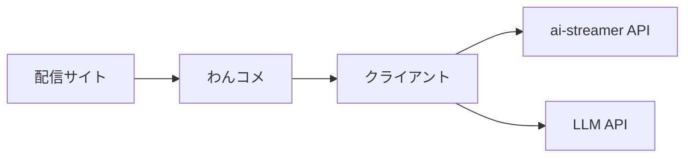
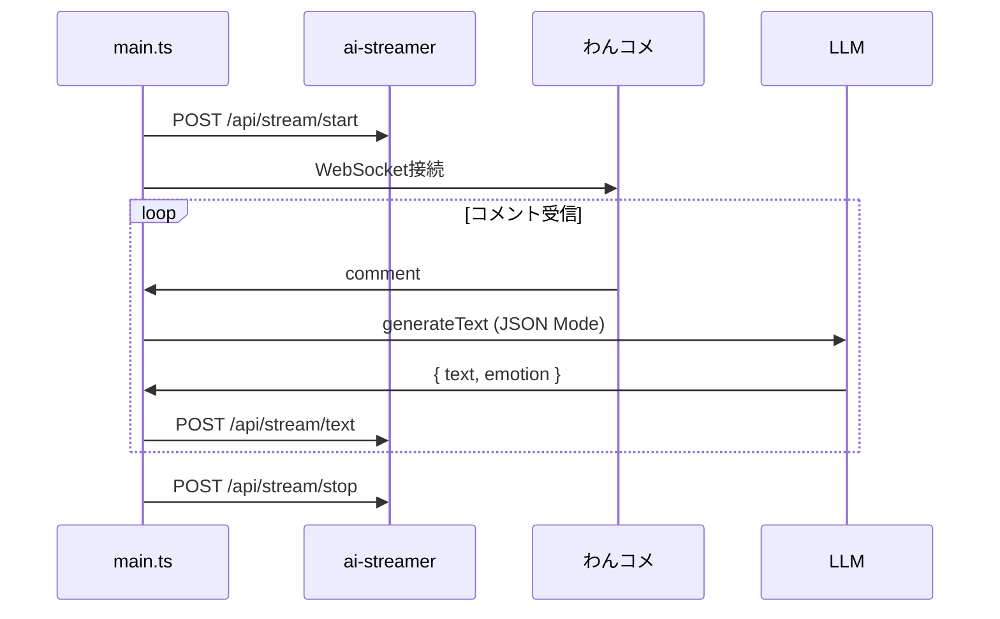
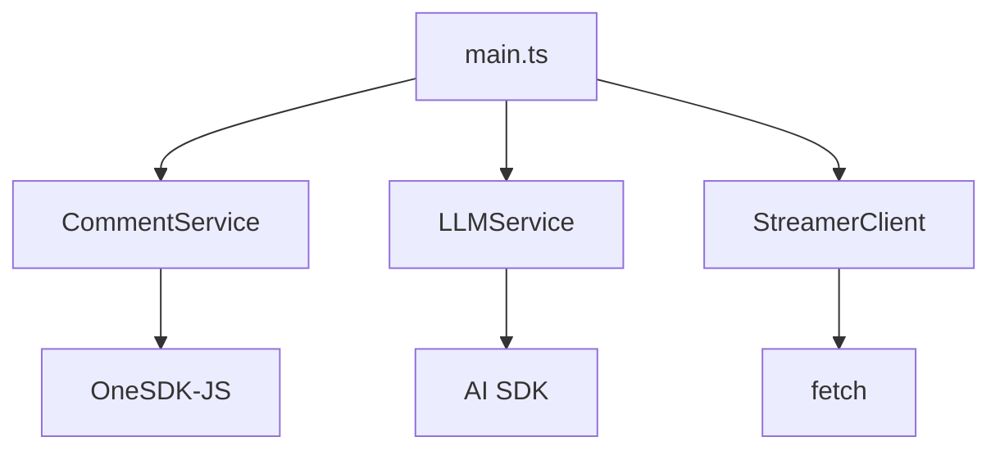

# テンプレートクライアント設計書

## 1. 概要

配信サイトのコメントを取得し、LLMで処理した応答をai-streamer APIに送信するサンプルクライアント。



### 処理フロー



1. **起動時**: ai-streamer の `/api/stream/start` を呼び出し、わんコメに接続
2. **コメント受信時**: LLMで応答生成 → `/api/stream/text` で送信
3. **終了時**: `/api/stream/stop` を呼び出して終了

---

## 2. アーキテクチャ



| コンポーネント | 責務 |
|--------------|------|
| **main.ts** | アプリケーション起動、イベントループ |
| **CommentService** | わんコメへの接続、コメント購読 |
| **LLMService** | LLM API呼び出し、JSON応答生成 |
| **StreamerClient** | ai-streamer APIへのリクエスト送信 |

---

## 3. 技術スタック

| カテゴリ | 技術 | 用途 |
|---------|------|------|
| 言語 | TypeScript | 型安全な開発 |
| ランタイム | Node.js 20+ | 実行環境 |
| コメント取得 | OneSDK-JS | わんコメ連携 |
| LLM | AI SDK | OpenAI等のLLM統合 |

---

## 4. ディレクトリ構造

```
example/client/
├── src/
│   ├── main.ts                 # エントリーポイント
│   ├── comment.service.ts      # コメント取得
│   ├── llm.service.ts          # LLM処理
│   └── streamer.client.ts      # API送信
├── config.example.json         # 設定ファイル例
├── package.json
├── tsconfig.json
└── README.md
```

---

## 5. コンポーネント詳細

### 5.0 main.ts

起動時にストリーム開始、終了時にストリーム停止を行う。

```typescript
import { CommentService } from './comment.service';
import { LLMService } from './llm.service';
import { StreamerClient } from './streamer.client';

async function main() {
  const commentService = new CommentService(config.onecomme);
  const llmService = new LLMService(config.llm);
  const streamerClient = new StreamerClient(config.streamer);

  // 起動時: ストリーム開始 & わんコメ接続
  await streamerClient.startStream();
  await commentService.connect();

  // コメント受信時の処理
  commentService.onComment(async (comment) => {
    const response = await llmService.generateResponse(comment.data.comment);
    await streamerClient.sendText(response);
  });

  // 終了時: クリーンアップ
  process.on('SIGINT', async () => {
    commentService.disconnect();
    await streamerClient.stopStream();
    process.exit(0);
  });
}

main();
```

### 5.1 CommentService

わんコメからコメントを取得する。

```typescript
interface CommentService {
  connect(): Promise<void>;
  disconnect(): void;
  onComment(callback: (comment: Comment) => void): void;
}
```

### 5.2 LLMService

コメントに対するAI応答をJSON形式で生成する。

```typescript
// LLMからJSON形式で返却されるレスポンス
interface LLMResponse {
  text: string;
  emotion: string;  // neutral, happy, sad, angry, surprised
}

interface LLMService {
  generateResponse(comment: string): Promise<LLMResponse>;
}
```

**実装例:**

```typescript
import { generateText } from 'ai';
import { openai } from '@ai-sdk/openai';

const result = await generateText({
  model: openai('gpt-4o-mini', { structuredOutputs: true }),
  messages: [
    { role: 'system', content: systemPrompt },
    { role: 'user', content: comment }
  ],
  responseFormat: {
    type: 'json_schema',
    jsonSchema: {
      name: 'response',
      schema: {
        type: 'object',
        properties: {
          text: { type: 'string', description: '視聴者への返答' },
          emotion: {
            type: 'string',
            enum: ['neutral', 'happy', 'sad', 'angry', 'surprised'],
            description: '返答の感情'
          }
        },
        required: ['text', 'emotion']
      }
    }
  }
});

const response: LLMResponse = JSON.parse(result.text);
```

### 5.3 StreamerClient

ai-streamer APIにリクエストを送信する。

```typescript
interface StreamerClient {
  startStream(): Promise<void>;
  stopStream(): Promise<void>;
  sendText(response: LLMResponse): Promise<void>;
}
```

**実装例:**

```typescript
async sendText(response: LLMResponse): Promise<void> {
  await fetch(`${this.baseUrl}/api/stream/text`, {
    method: 'POST',
    headers: { 'Content-Type': 'application/json' },
    body: JSON.stringify({
      presetId: this.presetId,
      requests: [
        {
          action: 'speak',
          params: {
            text: response.text,
            emotion: response.emotion
          }
        }
      ]
    })
  });
}
```

---

## 6. 設定ファイル

```json
{
  "llm": {
    "model": "gpt-4o-mini",
    "systemPrompt": "あなたは配信者のAIアシスタントです。視聴者のコメントに対して短く親しみやすい返答をしてください。"
  },
  "streamer": {
    "baseUrl": "http://localhost:4000",
    "presetId": "anchor-a"
  }
}
```

### 環境変数

| 変数名 | 説明 |
|--------|------|
| `OPENAI_API_KEY` | OpenAI APIキー |

---

## 7. 注意点

- わんコメがローカルで起動している必要がある（固定: `localhost:11180`）
- ai-streamerが起動している必要がある（デフォルト: `localhost:4000`）
- LLMの利用にはAPIキーと課金が必要
